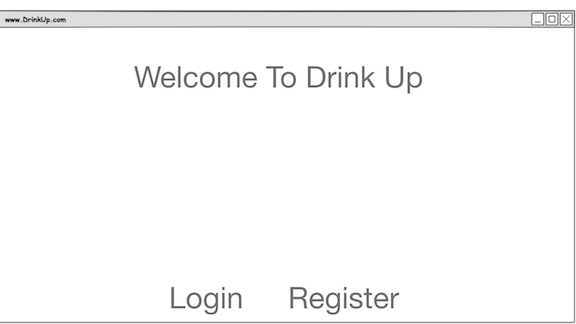
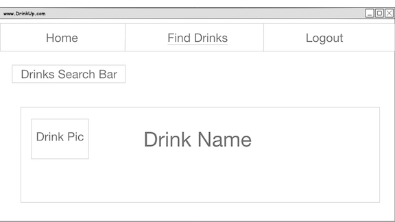
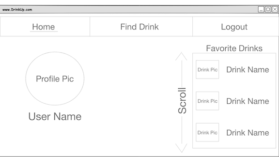
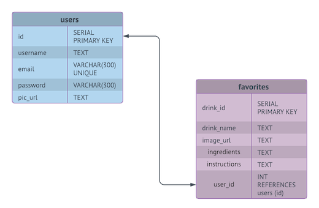

# DrinkUp

## Overview
So you realize you are starting to gravitate toward gin cocktails but you have no idea 
what goes in your favorite cocktail, OR maybe you want to try other gin-based cocktails but don't know their official names.  Here is where this app will improve your life.    
  
Our app is a database of cocktails including names, images ingredients and instructions. A user can go to our website and is given the option to register if they
don't currently have an account or if they do have an account they can log right in.  
  
Once they have logged in they can search for cocktails and add a
cocktail to their "favorites" list.  From their "favorites" they can view all their cocktails, edit a cocktail to create a custom cocktail and delete a cocktail from their favorites.    
  
Now let's go get a drink!

## Wireframe
 
 
 

## Pages/Components
+ Landing Page
+ User Register Page
+ User Login Page
+ Choose Find Drink or Find Happy Hour
+ Find Drink
    + Nav Bar
    + Search Bar
    + Drink Output List
+ My Fav Drinks
    + Nav Bar
    + Profile
    + Fav Drink List
+ Make A Drink/Edit a Drink
    + Nav Bar
    + Edit Drink filled out Form

  
## TABLES  
  

## CODE SNIPPETS
#### CONDITIONAL RENDERING
  We conditionally rendered our routes based on whether or not a user was logged in.  If a user was NOT logged in then they saw a different component at the home route '/' and were only given options to log in or register.  
  When a user was logged in then they saw their profile rendered to the home route '/' and had access to full CRUD capabilities.  

#### FILTERING DRINKS
  In order to  implement a search bar we needed to create a filter function that took the object of all our drinks and looked for matches with our variable 'searchTerm' and then only rendered Drinks that included our search term.  

#### HANDLING DRINK INGREDIENTS
  Our API gave us back a drink object that listed ingredients individually 
  in up to 15 different key/property combos so we had to take that data and compile it 
  and concatenate it so that it was just one entry of ingredients in our database.  
  

  
## TECHNOLOGIES  

#### CORE STACK
+ Node.js
+ Express
+ React
+ PostgresSQL
+ HTML
+ CSS
+ Javascript

#### MIDDLEWARE
+ nodemon
+ pg-promise
+ react-routers
+ PostgresSQL

#### API FETCHES
+ Search By Category Alcoholic
    + https://www.thecocktaildb.com/api/json/v1/1/filter.php?a=Alcoholic
+ Search by drink ID
    + https://www.thecocktaildb.com/api/json/v1/1/lookup.php?i=15346###Features

#### OTHER
+ Lucidchart (tables/flow)
+ Postman (API and DB testing)
+ Slack (communication)
+ Heroku

## See The Project...
Live Deployment of App: 
http://LinkWillGoHereXXXXXXXXXX
